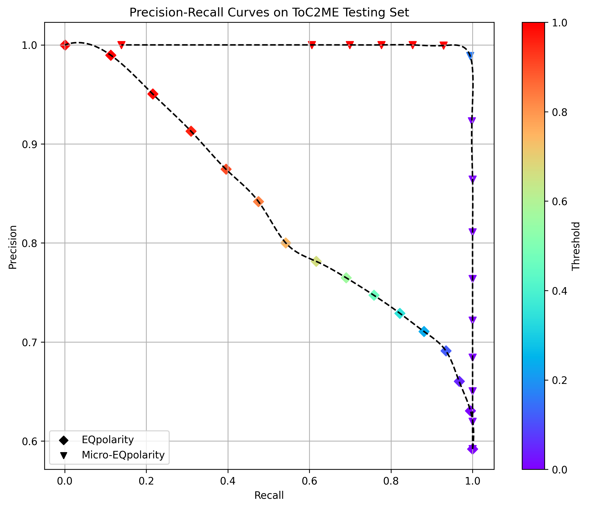

# Micro-EQpolarity
**Micro-EQpolarity** is Jiachen Hu's code repository for polarity picking and focal mechanism analyses in Canada.

<div style="text-align: center;">
  
  <p><b>Figure 1:</b> (a) Regional map of the ToC2ME study area (red box) in Alberta. (b) Map of the ToC2ME monitoring configuration with 69 stations, recording 21,619 events in ML -2.19 to 3.21.</p>
</div>

## Overview
This repository provides a comprehensive set of tools and workflows for working with the ToC2Me dataset. The main components of this repository are:

## 1. HASH Workflow

### Description

This section includes the process for solving focal mechanisms using the SKHASH on the ToC2Me dataset. Users can choose to either manually pick polarities or utilize the EQpolarity model for automatic polarity picking.

<div style="text-align: center;">
  
  <p><b>Figure 2:</b> Workflow for calculating focal mechanisms of microseismic events using transfer learning to adapt the EQpolarity model to microseismic P-wave first-motion polarity determination.</p>
</div>

---

## 2. Focal Mechanisms Analyses

### Description
This section includes a series of scripts showing analyses in the ToC2ME area based on FMSs, including spatial distribution, magnitude distribution, and FMS classification.

- Generated by [Code_ToC2ME/Focal_Mechanisms_Analyses/Mapping_size_magnitude.py](https://github.com/hhhjjjcc/Micro-EQpolarity/blob/main/Code_ToC2ME/Focal_Mechanisms_Analyses/Mapping_size_magnitude.py)
<div style="text-align: center;">
  
  <p><b>Figure 3:</b> Map view of high-quality focal mechanism solutions in ToC2ME.</p>
</div>

- Generated by [Code_ToC2ME/Focal_Mechanisms_Analyses/plot_mechanisms_upgrade_with_average_mechanism_color_variation_for_group1.py](https://github.com/hhhjjjcc/Micro-EQpolarity/blob/main/Code_ToC2ME/Focal_Mechanisms_Analyses/plot_mechanisms_upgrade_with_average_mechanism_color_variation_for_group1.py) to [Code_ToC2ME/Focal_Mechanisms_Analyses/plot_mechanisms_upgrade_with_average_mechanism_color_variation_for_group_other_faults.py](https://github.com/hhhjjjcc/Micro-EQpolarity/blob/main/Code_ToC2ME/Focal_Mechanisms_Analyses/plot_mechanisms_upgrade_with_average_mechanism_color_variation_for_group_other_faults.py) 
<div style="text-align: center;">
  
  <p><b>Figure 4:</b> Classification of focal mechanism solutions in ToC2ME.</p>
</div>

- Generated by [Code_ToC2ME/Focal_Mechanisms_Analyses/Magnitude_Distribution_all_and_final_upgrade_with_numEQ_20241203.py](https://github.com/hhhjjjcc/Micro-EQpolarity/blob/main/Code_ToC2ME/Focal_Mechanisms_Analyses/Magnitude_Distribution_all_and_final_upgrade_with_numEQ_20241203.py)
<div style="text-align: center;">
  
  <p><b>Figure 5:</b> Magnitude distribution of seismic events in ToC2ME in late 2016, with the right panel showing a frequency histogram at 0.1 magnitude intervals.</p>
</div>

---

## 3. Plot Waveforms on Focal Mechanisms

### Description
This section provides a script that enable users to plot waveforms directly with focal mechanism beachball diagrams. This feature helps validate the correctness of the mechanism solutions by allowing users to check waveforms and station locations.

- Generated by [Code_ToC2ME/Plot_waveform_on_mechanisms/Focal_mechanism_with_waveform_20241117_skhash.py](https://github.com/hhhjjjcc/Micro-EQpolarity/blob/main/Code_ToC2ME/Plot_waveform_on_mechanisms/Focal_mechanism_with_waveform_20241117_skhash.py)
<div style="text-align: center;">
  
  <p><b>Figure 6:</b> An example of an FMS with a magnitude of -1.07 and its corresponding polarity classification results as a function of back-azimuth.</p>
</div>

### Notes:
- In the ToC2ME dataset, waveform polarities are inverted.

---

## 4. EQpolarity Transfer Learning

### Description
This section demonstrates the application of transfer learning using EQpolarity models on the ToC2Me dataset.

---

## Gallery
Here are the important figures shown in the paper/poster.

### Accuracy on Microseismic Events（ToC2ME）
- Accuracy for each model can be obtained from [Code_ToC2ME/EQpolarity_Transfer_Learning/CCT_ToC2ME_TransferLearning_20240926_For_Test_update20241013.ipynb](https://github.com/chenyk1990/jiachenToc2Me/blob/main/Code_ToC2ME/EQpolarity_Transfer_Learning/CCT_ToC2ME_TransferLearning_20240926_For_Test_update20241013.ipynb)

#### The models are as follows
- Blue: [model/SCSN/best_weigths_Binary_SCSN_Best.h5](https://github.com/chenyk1990/jiachenToc2Me/blob/main/model/SCSN/best_weigths_Binary_SCSN_Best.h5)
- Orange: [model/Texas/best_weigths_Binary_Texas_Transfer10.h5](https://github.com/chenyk1990/jiachenToc2Me/blob/main/model/Texas/best_weigths_Binary_Texas_Transfer10.h5)
- Red: [model/Toc2me_20240819_Transfer_Learning_21916data/best_weigths_Binary_Toc2me_Transfer_SCSN_20241013_21916data_90.h5](https://github.com/chenyk1990/jiachenToc2Me/blob/main/model/Toc2me_20240819_Transfer_Learning_21916data/best_weigths_Binary_Toc2me_Transfer_SCSN_20241013_21916data_90.h5)


### EQpolarity Transfer Learning Confusion Matrix, PR Curve, ROC Curve with Canada Best Model
- Generated by [Code_ToC2ME/EQpolarity_Transfer_Learning/CCT_ToC2ME_TransferLearning_20240926_For_Test_update20241013.ipynb](https://github.com/chenyk1990/jiachenToc2Me/blob/main/Code_ToC2ME/EQpolarity_Transfer_Learning/CCT_ToC2ME_TransferLearning_20240926_For_Test_update20241013.ipynb) with model [model/Toc2me_20240819_Transfer_Learning_21916data/best_weigths_Binary_Toc2me_Transfer_SCSN_20241013_21916data_90.h5](https://github.com/chenyk1990/jiachenToc2Me/blob/main/model/Toc2me_20240819_Transfer_Learning_21916data/best_weigths_Binary_Toc2me_Transfer_SCSN_20241013_21916data_90.h5)




### Top View of Focal Mechanisms
- Generated by [Code_ToC2ME/Focal_Mechanisms_Analyses/Mapping.py](https://github.com/chenyk1990/jiachenToc2Me/blob/main/Code_ToC2ME/Focal_Mechanisms_Analyses/Mapping.py)


- Generated by [Code_ToC2ME/Focal_Mechanisms_Analyses/Strike_rake_mapping_with_mt_solution.py](https://github.com/chenyk1990/jiachenToc2Me/blob/main/Code_ToC2ME/Focal_Mechanisms_Analyses/Strike_rake_mapping_with_mt_solution.py)


### Rose Diagrams in ToC2ME
- Generated by [Code_ToC2ME/Focal_Mechanisms_Analyses/rose_figure_upgrade_with_dip.py](https://github.com/chenyk1990/jiachenToc2Me/blob/main/Code_ToC2ME/Focal_Mechanisms_Analyses/rose_figure_upgrade_with_dip.py)


### Waveforms on Focal Mechanisms
- Generated by [Code_ToC2ME/Plot_waveform_on_mechanisms/Focal_mechanism_with_waveform_20241117_skhash.py](https://github.com/chenyk1990/jiachenToc2Me/blob/main/Code_ToC2ME/Plot_waveform_on_mechanisms/Focal_mechanism_with_waveform_20241117_skhash.py)


---

## Data
1. ToC2ME all waveforms: https://doi.org/10.5281/zenodo.14185578

2、ToC2ME 2519 FMSs waveforms: https://doi.org/10.5281/zenodo.15165318

3. Texas data: Google Drive link: https://drive.google.com/drive/folders/1WXVB8ytNB4bOaZ97oq6OmMRyAEg95trp?usp=sharing

4. Texas_22980 data: https://doi.org/10.5281/zenodo.13901460

5. ToC2ME_Testing_data: In the `data` folder

---

## Environment Setup

To create and set up the required environment, follow these steps:

```bash
# Step 1: Create a Conda environment with Python 3.11.7
conda create -n eqp python=3.11.7

# Step 2: Activate the Conda environment
conda activate meqp

# Step 3: Install Jupyter Notebook
conda install ipython notebook

# Step 4: Install additional dependencies
pip install matplotlib==3.8.0 tensorflow==2.14.0 scikit-learn==1.2.2 seaborn==0.13.2

(optional)
# obspy
conda install -c conda-forge obspy

# openpyxl
conda install openpyxl
```
---

## Reference
1. Chen Y, Saad OM, Savvaidis A, Zhang F, Chen Y, Huang D, Li H, Zanjani FA, 2024, Deep learning for P-wave first-motion polarity determination and its application in focal mechanism inversion. IEEE Transactions on Geoscience and Remote Sensing, 62, 5917411.
2. Skoumal, R.J., Hardebeck, J.L., Shearer, P.M. (2024). SKHASH: A Python package for computing earthquake focal mechanisms. Seismological Research Letters, 95(4), 2519-2526. https://doi.org/10.1785/0220230329
3. Fangxue Zhang, Ruijia Wang, Yunfeng Chen, and Yangkang Chen. Spatiotemporal variations in earthquake triggering mechanisms during multistage hydraulic fracturing in western Canada. Journal of Geophysical Research: Solid Earth, 127, 08 2022. doi: 10.1029/2022JB024744.
